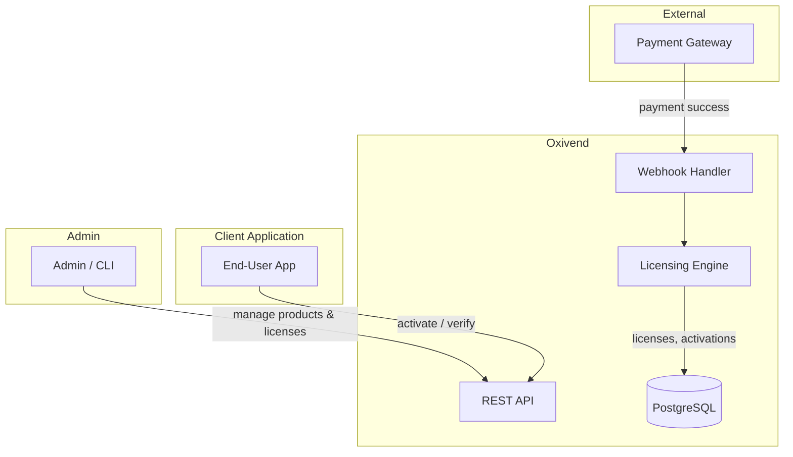

<p align="center">
  
</p>

<p align="center">
  A lightweight, headless BaaS for selling, distributing, and licensing digital products.<br>
  Written in Rust, backed by PostgreSQL. Licensed under Apache 2.0.
</p>

## Features

- **Product Management** — Create and manage software products with Ed25519 key pairs
- **License Issuance** — Generate signed license tokens using per-product private keys
- **Online Activation** — Device fingerprinting with configurable activation limits
- **Revocation** — Revoke licenses and blacklist devices
- **Secure Crypto** — Ed25519 signing, AES-256-GCM encrypted private key storage
- **Docker Ready** — Multi-stage build, single binary deployment
- **REST API** — Clean JSON API with JWT authentication

## Architecture



## Quick Start

```bash
docker compose -f docker/docker-compose.yml up -d
```

Server starts on `http://localhost:3000`.

## Environment Variables

| Variable | Required | Default | Description |
|----------|----------|---------|-------------|
| `DATABASE_URL` | Yes | — | PostgreSQL connection string |
| `OXIVEND_ADMIN_EMAIL` | Yes | — | Admin email for first-boot seed |
| `OXIVEND_ADMIN_PASSWORD` | Yes | — | Admin password for first-boot seed |
| `JWT_SECRET` | No | `changeme-dev-secret` | Session signing key |
| `PRIVATE_KEY_ENCRYPTION_KEY` | No | `dev-encryption-key-123` | AES-256-GCM key for private keys |

## API

| Method | Path | Auth | Description |
|--------|------|------|-------------|
| `GET` | `/health` | No | Health check |
| `POST` | `/login` | No | Admin login |
| `POST` | `/auth/refresh` | No | Refresh access token |
| `POST` | `/products` | Yes | Create product |
| `GET` | `/products` | Yes | List products |
| `GET` | `/products/{id}` | Yes | Get product |
| `PUT` | `/products/{id}` | Yes | Update product |
| `DELETE` | `/products/{id}` | Yes | Soft-delete product |
| `POST` | `/products/{id}/keys` | Yes | Generate Ed25519 key pair |
| `POST` | `/licenses` | Yes | Issue license |
| `POST` | `/licenses/verify` | No | Activate/verify license |
| `POST` | `/licenses/{id}/revoke` | Yes | Revoke license |

## Development

```bash
# Start PostgreSQL
docker compose -f docker/docker-compose.yml up -d postgres

# Run the server
cargo run

# Run tests
cargo test

# Lint
cargo clippy -- -D warnings

# Format
cargo fmt
```

## Tech Stack

- **Language:** Rust (edition 2024)
- **Web Framework:** Axum 0.8
- **Database:** PostgreSQL 18 via sqlx 0.9
- **Crypto:** Ed25519 (ed25519-dalek), AES-256-GCM (aes-gcm)
- **Auth:** Argon2 password hashing, JWT sessions
- **Runtime:** Tokio async runtime

## License

Apache 2.0. See [LICENSE](LICENSE).
